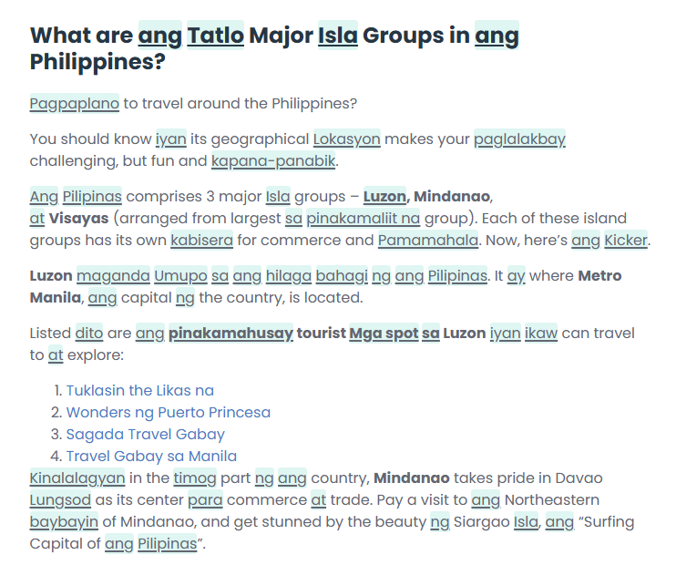

# Technical Specification — Landing Page Conversion Improvements

## Difficulty: Medium

Three distinct UI changes with no shared dependencies. No build system, no framework — pure HTML/CSS/JS static site.

---

## Technical Context

- **Language/stack**: Vanilla HTML5, CSS3, JavaScript (ES5-style IIFE in `script.js`)
- **Assets**: served from `./assets/`
- **No external component libraries** — all interactivity is hand-rolled
- **Three source files** touched: `index.html`, `styles.css`, `script.js`
- **Three asset files** must be copied from external locations into `./assets/`

---

## Asset Migration (prerequisite)

Copy these files before implementation begins:

1. `C:\Users\david\Videos\YoutubeVideos\HariVidDemo.mp4` → `.\assets\HariVidDemo.mp4`
2. `C:\Users\david\Downloads\beforehari.png` → `.\assets\beforehari.png`
3. `C:\Users\david\Downloads\withhari.png` → `.\assets\withhari.png`

---

## Change 1 — Replace Demo Video + Improve Layout (Scene 2: `scene--demo`)

### What changes

- `<source src="./assets/HariDemo.mp4">` → `<source src="./assets/HariVidDemo.mp4">`
- Improved layout around the video for conversion:
  - Add a small trust line inside `.demo-frame-wrap` below the video frame (subtle muted text — e.g. "Works on Reddit, Wikipedia, news, social feeds")
  - Rewrite the three `.demo-callout` items to be outcome/benefit focused with a stronger emotional hook
  - Add a CTA button ("Add to Chrome — it's free") directly below `.demo-layout`, before the user scrolls away

### Files modified
- `index.html` — update `<source>`, rewrite callout copy, add trust line + CTA
- `styles.css` — add `.demo-trust` (small muted text below video), `.demo-bottom-cta` (centered CTA container)
- `script.js` — no changes

---

## Change 2 — Drag-to-Compare Slider (Scene 4: `scene--culture`)

### What's removed
The entire `.comparison-toggle-wrap` block (tabs + two panels) and the `document.querySelectorAll('.comparison-tabs')` JS handler block.

### What replaces it

An interactive before/after drag slider built in pure JS using the Pointer Events API.

**HTML structure** (replaces `.comparison-toggle-wrap`):

```html
<div class="ba-slider" id="ba-slider" aria-label="Before and after: drag to compare">
  <div class="ba-after">
    
    <span class="ba-label ba-label--after">With Hari</span>
  </div>
  <div class="ba-before">
    
    <span class="ba-label ba-label--before">Without Hari</span>
  </div>
  <div class="ba-handle" aria-hidden="true">
    <div class="ba-handle-line"></div>
    <div class="ba-handle-knob"><!-- left/right chevron SVG --></div>
    <div class="ba-handle-line"></div>
  </div>
</div>
```

**CSS approach**:
- `.ba-slider`: `position: relative; overflow: hidden; border-radius: 12px; cursor: ew-resize`
- `.ba-after`: full-width base layer; image fills width
- `.ba-before`: `position: absolute; inset: 0; overflow: hidden; width: 50%` (clips the before image)
- `.ba-before img`: `position: absolute; top: 0; left: 0` with natural width so clipping works
- `.ba-handle`: `position: absolute; top: 0; bottom: 0; left: 50%; width: 2px; background: white; transform: translateX(-50%); display: flex; flex-direction: column; align-items: center`
- `.ba-handle-knob`: circular white grab knob (40px) centered on the line; contains left/right chevron SVG
- `.ba-label`: small pill badges positioned top-left / top-right corners

**JS approach** (inside the IIFE in `script.js`):

```js
function initBaSlider() {
    var slider = document.getElementById('ba-slider');
    if (!slider) return;
    var before = slider.querySelector('.ba-before');
    var handle = slider.querySelector('.ba-handle');
    var isDragging = false;

    function setPercent(clientX) {
        var rect = slider.getBoundingClientRect();
        var pct = Math.min(Math.max((clientX - rect.left) / rect.width, 0.02), 0.98);
        before.style.width = (pct * 100) + '%';
        handle.style.left = (pct * 100) + '%';
    }

    slider.addEventListener('pointerdown', function(e) {
        isDragging = true;
        slider.setPointerCapture(e.pointerId);
        setPercent(e.clientX);
    });
    slider.addEventListener('pointermove', function(e) {
        if (isDragging) setPercent(e.clientX);
    });
    slider.addEventListener('pointerup', function() { isDragging = false; });
    slider.addEventListener('pointercancel', function() { isDragging = false; });
}
initBaSlider();
```

Remove the old `document.querySelectorAll('.comparison-tabs')` handler block entirely.

### Files modified
- `index.html` — replace `.comparison-toggle-wrap` with `.ba-slider`
- `styles.css` — remove `.comparison-tabs/.comparison-tab/.comparison-panel/.comparison-display` styles; add `.ba-slider` and child styles
- `script.js` — remove `querySelectorAll('.comparison-tabs')` block; add `initBaSlider()` function and call

---

## Change 3 — Replace "Who It's For" with "Philosophy" Section (Scene 6)

### What's removed
Entire content of `scene--who`: `.who-header`, `.who-intro`, `.persona-cards` (3 cards with SVG icons).

### What replaces it

A "The Hari Method" immersion philosophy section. The outer `.scene` element is reused.
- Class: `scene--who` → `scene--philosophy`
- ID: `scene-who` → `scene-philosophy`

**Layout**: centered header block + three card grid (same visual pattern as persona cards).

**Content**:
- Eyebrow: `The Hari Method`
- Headline: `The fastest way to learn a language is to live inside it`
- Body: Research on comprehensible input shows that passive, contextual exposure builds vocabulary faster and retains it longer than flashcards or drilling. Immersion learners consistently outperform classroom learners — Hari brings that same approach to your daily screen time.
- Three cards:
  1. **Comprehensible Input** — You absorb new words fastest when you see them inside sentences you already mostly understand. Hari places Tagalog exactly there — in the articles and feeds you already read.
  2. **Repetition Without Effort** — Your brain locks in vocabulary through repeated exposure across different contexts over time. Hari automates that repetition every time you browse.
  3. **Maximum Exposure, Zero Disruption** — Immersion programs work because they maximize time with the language. Hari brings that exposure to your existing screen time — no schedule required.
- Bottom note (italic, muted): This is the same mechanism behind immersion programs, heritage language recovery, and how children naturally acquire their first language.

**CSS approach**:
- Rename `.scene--who` → `.scene--philosophy`; rename `.who-header` → `.philosophy-header`, `.persona-cards` → `.philosophy-cards`, `.persona-card` → `.philosophy-card`
- Reuse the same card visual design (dark bg, border, border-radius, teal hover glow, staggered entry animations)
- Add `.philosophy-body` for the intro paragraph (styled like `.culture-intro`)
- Add `.philosophy-note` for the bottom italic note (styled like `.culture-note`)
- Card icons: use teal-colored numeral or a simple teal square/dot accent instead of SVG icons

### Files modified
- `index.html` — replace section content, update class and id
- `styles.css` — rename selectors from `who`/`persona` to `philosophy` equivalents; remove unused old selectors
- `script.js` — no changes (observer uses generic `.scene[data-scene]` selector)
- `index.html` footer — update `href="#scene-who"` → `href="#scene-philosophy"` and link text to "Philosophy"

---

## Interface / Data Changes

None. No API, no data model, no new dependencies.

---

## Verification

1. **Manual visual check** (open `index.html` locally in Chrome):
   - New video autoplays, muted, looping; frame renders correctly
   - Drag slider responds to mouse drag; handle and labels visible; before/after images display correctly on both sides
   - Philosophy cards animate in on scroll, consistent with rest of page
   - New CTA below demo links to `./go/chrome/`
   - Footer link updated correctly
2. **Responsive check** at 375px, 768px, 1280px:
   - Drag slider is grabbable on mobile touch (Pointer Events API handles touch natively)
   - Philosophy cards stack to 1 column on mobile
   - Demo callouts stack below video on mobile
3. **Accessibility**:
   - `.ba-slider` has `aria-label`
   - All images have descriptive `alt` text
   - No broken anchor links pointing to removed IDs
